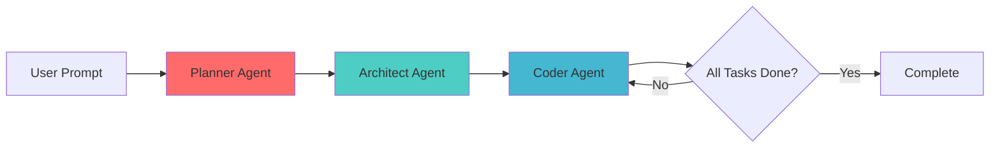

# 🤖 AI Code Architect

<div align="center">


**Transform natural language into production-ready code with AI-powered multi-agent architecture**

[Features](#-features) • [Installation](#-installation) • [Usage](#-usage) • [Architecture](#-architecture) • [Examples](#-examples)

</div>

---

## 🌟 Overview

AI Code Architect is an intelligent code generation system that uses a multi-agent architecture to convert natural language descriptions into fully functional applications. Powered by LangChain and LangGraph, it orchestrates three specialized AI agents working in harmony:

- 🎯 **Planner Agent**: Analyzes requirements and creates high-level plans
- 🏗️ **Architect Agent**: Designs file structure and implementation steps
- 💻 **Coder Agent**: Writes actual code with tool-use capabilities

## ✨ Features

- **🧠 Multi-Agent Collaboration**: Three specialized agents work together for optimal results
- **📝 Natural Language Input**: Describe what you want in plain English
- **🔧 Tool-Augmented Generation**: Agents can read, write, and navigate files intelligently
- **🎨 Structured Output**: Type-safe planning and execution using Pydantic models
- **🔄 Iterative Development**: Agents iterate until all tasks are complete
- **📦 File System Management**: Automatic file creation and organization
- **🚀 Production Ready**: Built with LangChain and LangGraph for reliability

## Use Cases

- Generate complete web applications (HTML, CSS, JavaScript)
- Create Python scripts and utilities
- Build API endpoints and services
- Develop data processing pipelines
- Prototype applications rapidly
- Generate boilerplate code

## Installation

### Prerequisites

- Python 3.9 or higher
- OpenAI API key

### Setup

1. **Clone the repository**
```bash
git clone https://github.com/yourusername/ai-code-architect.git
cd ai-code-architect
```

2. **Create virtual environment**
```bash
python -m venv venv
source venv/bin/activate  # On Windows: venv\Scripts\activate
```

3. **Install dependencies**
```bash
pip install -r requirements.txt
```

4. **Configure environment**
Create a `.env` file in the root directory:
```env
OPENAI_API_KEY=your_openai_api_key_here
```

## 💡 Usage

### Basic Usage

```python
from main import agent

# Describe what you want to build
user_prompt = "Create a simple working calculator web application in HTML, CSS and js."

# Let the AI agents do the work
result = agent.invoke({"user_prompt": user_prompt}, {"recursion_limit": 100})
```

### Running the Example

```bash
python main.py
```

This will generate a complete calculator web application with HTML, CSS, and JavaScript files.

### Custom Prompts

```python
# Todo App Example
user_prompt = """
Create a todo list application with the following features:
- Add new tasks
- Mark tasks as complete
- Delete tasks
- Save to localStorage
Use vanilla JavaScript, HTML, and CSS
"""

result = agent.invoke({"user_prompt": user_prompt}, {"recursion_limit": 100})
```

## 🏗️ Architecture



### Agent Flow

1. **Planner Agent** 🎯
   - Analyzes user requirements
   - Creates structured plan with objectives
   - Defines success criteria

2. **Architect Agent** 🏗️
   - Designs file structure
   - Breaks down into implementation steps
   - Creates task dependencies

3. **Coder Agent** 💻
   - Implements each step sequentially
   - Uses tools to read/write files
   - Iterates until completion

### State Management

The system uses LangGraph's state management to maintain context across agents:

```python
State = {
    "user_prompt": str,
    "plan": Plan,
    "task_plan": TaskPlan,
    "coder_state": CoderState,
    "status": str
}
```

## 📁 Project Structure

```
ai-code-architect/
│
├── main.py                 # Main orchestration logic
├── prompts.py             # Agent prompts and instructions
├── states.py              # Pydantic state models
├── tool.py                # File system tools
├── requirements.txt       # Project dependencies
├── .env                   # Environment variables (create this)
├── .gitignore            # Git ignore rules
└── README.md             # This file
```

## 🛠️ Tools Available to Agents

| Tool | Description | Usage |
|------|-------------|-------|
| `write_file` | Write content to a file | Creates or overwrites files |
| `read_file` | Read file contents | Retrieves existing code |
| `list_files` | List directory contents | Navigate file system |
| `get_current_directory` | Get working directory | Verify location |

## 📊 Examples

### Example 1: Calculator App

**Input:**
```python
user_prompt = "Create a simple working calculator web application"
```

**Output:**
- `calculator.html` - HTML structure
- `calculator.css` - Styling
- `calculator.js` - Calculator logic


## 🔧 Configuration

### Model Selection

Change the LLM model in `main.py`:

```python
llm = ChatOpenAI(
    model="gpt-4o",  # Options: gpt-4o, gpt-4-turbo, gpt-3.5-turbo
    temperature=1.0
)
```

### Recursion Limit

Adjust the number of iterations:

```python
result = agent.invoke(
    {"user_prompt": user_prompt},
    {"recursion_limit": 100}  # Increase for complex projects
)
```

### Debug Mode

Enable detailed logging:

```python
from langchain.globals import set_verbose, set_debug

set_debug(True)
set_verbose(True)
```

## 🤝 Contributing

Contributions are welcome! Here's how you can help:

1. Fork the repository
2. Create a feature branch (`git checkout -b feature/AmazingFeature`)
3. Commit your changes (`git commit -m 'Add some AmazingFeature'`)
4. Push to the branch (`git push origin feature/AmazingFeature`)
5. Open a Pull Request


## 🙏 Acknowledgments

- Built with [LangChain](https://github.com/langchain-ai/langchain)
- Powered by [LangGraph](https://github.com/langchain-ai/langgraph)
- Uses [OpenAI GPT Models](https://openai.com)

## 📧 Contact

For questions and support:
- Open an issue on GitHub
- Email: muskkaniyer@gmail.com
- LinkedIn: https://www.linkedin.com/in/muskkaniyer/  

---

<div align="center">

**⭐ Star this repo if you find it helpful!**

Made with ❤️ by AI enthusiast

</div>
